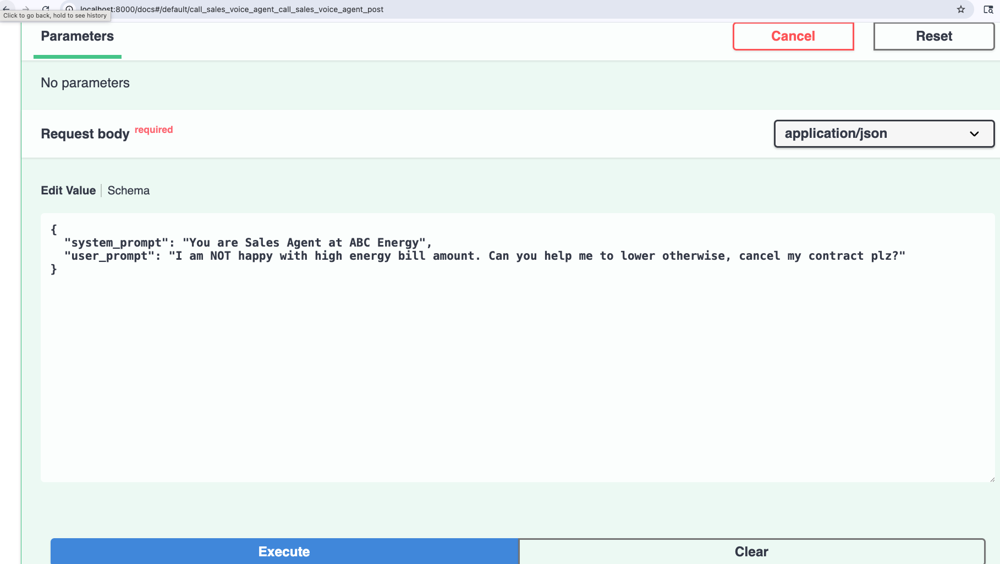
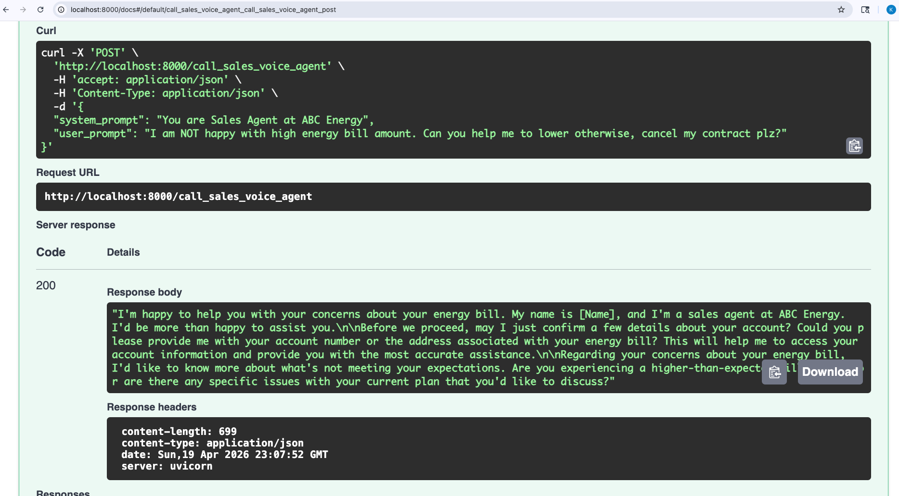
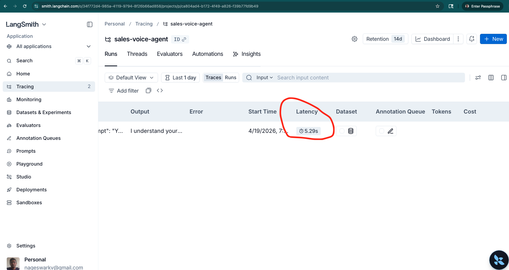

## Checklist

 - ✅ Data Engineering — SGD + synthetic, cleaning, splits                                                                           
  - ✅ SFT + QLoRA — loss 1.47→0.40, adapter saved                                                                                    
  - ✅ DPO — data generated, code written, documented in whitepaper
  - ✅ GGUF quantization — BF16 done, q4_k_m done                                                                                     
  - ✅ vLLM serving — working endpoint with ngrok                                                                                     
  - ✅ Evaluation — 6.9/10 overall score                                                                                              
  - ✅ W&B tracking — added to training                                                                                               
  - ✅ LangSmith tracing — added to FastAPI                                                                                           
  - ✅ Locust benchmarking — script written                                                                                           
  - ✅ README + WHITEPAPER — both written                                                                                             
  - ✅ uv — in README      

## Implementation Snapshots:

## Eval Results                                                                                                                     
<h2>LLM-as-a-Judge (GPT-4o-mini) on fine-tuned model responses: </h2>                                                                         
 
                                                                                                                                     
  | Metric | Score |
  |--------|-------|                                                                                                                  
  | Overall | 6.9/10 |
  | Professionalism | 8.1/10 |
  | Empathy | 6.9/10 |                                                                                                                
  | Objection Handling | 6.1/10 |
  | Sales Effectiveness | 6.8/10 |                                                                                                    
                  

Setup                                                                                               

                                                                                                                     
  ### Prerequisites                                                                                                  
  - Python 3.12+  
  - Google Colab with L4 GPU (recommended)
  - HuggingFace account with Llama 3.1 access                                                                        
  - OpenAI API key
  - ngrok account                                                                                                    
                  
  ### Installation                                                                                                   
                  
  # Clone repo
  git clone https://github.com/torontodeveloper/sales-voice-agent
  cd sales-voice-agent                                                                                               
   
  # Install uv                                                                                                       
  pip install uv  

  # Install dependencies
  uv pip install -r requirements.txt
                                                                                                                     
  Environment Variables
                                                                                                                     
  export HF_TOKEN=your_huggingface_token
  export OPENAI_API_KEY=your_openai_key
  export NGROK_AUTH_TOKEN=your_ngrok_token                                                                           
   
  Run Pipeline                                                                                                       
                  
  # Step 1: Generate synthetic data
  python scripts/data/generate_synthetic-1.py
                                                                                                                     
  # Step 2: Load Schema Guided Dialogue(SGD) dataset
  python scripts/data/get_sgd_dataset-2.py                                                                           
                  
  # Step 3: Split dataset                                                                                            
  python scripts/data/split_dataset.py
                                                                                                                     
  # Step 4: Train (run in Colab)
  # Open sales-voice-agent.ipynb in Google Colab
                                                                                                                     
  # Step 5: start vLLM
 Run script associated with vLLM
                                                                                                                     
  # Step 6: Evaluate
  python scripts/eval/evaluate_vLLM.py   using vLLL which will publish public ngrok Url https://gothic-dyslexic-overstate.ngrok-free.dev/v1/chat/completions

  # Step 7: To run 1000 concurrent users
  locust -f scripts/bench/locust_bench.py --host https://gothic-dyslexic-overstate.ngrok-free.dev/v1/chat/completions.  We are not running Locust on colab or my local due to Out of Memory error possibility for 1000 concurrent users

  Step 8: To launch FastAPI server
  go to server directory and "fastapi dev" will last Fastapi SERVER
  go To localhost:8000/docs or use React client to access Sales Voice agent API Endpoint

# Sales Voice Agent

This pipeline architecture draws from my experience building a two-stage web agent on the Mind2Web dataset at CMU/Fleetworthy, where I applied similar data normalization, fine-tuning, and GPT-4o evaluation patterns.

ABC Energy is building a specialized LLM to power a next-generation Voice AI Sales Agent. The goal is to move beyond generic models and create a high-performance, domain-specific model capable of handling complex, real-time sales dialogues.

This builds a production-grade engineering loop: from raw data processing and fine-tuning to quantization and concurrency.

  

## Training Data

Training data combines real SGD task-oriented dialogues for natural conversation structure with GPT-4o synthesized energy sales scenarios for domain-specific objection handling and closing techniques.

## Design Decision

1. Added synthetic data generation of 8 energy-specific objection handling scenarios
2.Using Llama 3.1 8B base model, since there are more than 1000 records. As per Unsloth, a base model is a good option with a larger dataset, so we can fine-tune the LLM (Llama) on the given dataset.
3. we could use Data Version Control(DVC) to store versioning of dataset as we are not storing data in github due to larger volume of data
4. Choosing L4 GPU in Google Colab based on 
  - 22.5GB VRAM vs T4's 14.5GB                                                             
  - Much better for Llama 3.1 8B in 4-bit                                                                                  
  - Faster training    
5. Ran 60 steps for LLama SFT fine tuning as proof of concept due to time constraints. Production training would be more than 100 steps. Right now only one epoch but it can be increased to 3. Also, you can play with iteratons and see if loss goes down or up as you change iteration steps
6 Quantization: GGUF q4_k_m                                                                    - Reduces model from ~16GB (FP16) to ~4.5GB (4-bit)                                             
 - q4_k_m — best balance of quality vs size                                                      
- Deployed via llama.cpp or vLLM for low-latency inference
- Trade-off: slight quality loss (~1-2%) vs 4x memory reduction  
7.
There are function_only,function_cot and function_cot_nlg available options while loading dataset from SharedGPT format. I have chosed function_cot_nlg which is same as function_cot but the assistant has to give an additional natural language response corresponding to the function calls
   - I got low eval scores (overall 2-6.5/10) and hence regenerated synthetic data for 10 iterations with both positve scenarios and customer complaing scenarios to balance the dataset albeit around 1% of synthetic data due to time,memory,gpu constraints
8. LLM-as-a-Judge evaluation using GPT-4o-mini as referee to score        fine-tuned Llama responses on professionalism, empathy,                  objection handling and sales effectiveness 
9. Llama Models are gated models so you need access to HF and Llama access as well before you started using so I am using unsloth for the time being which are not gated
10. I used QLoRA(Quantized Low Ranking Adaption) via Unsloth — set load_in_4bit=True which applies NF4 quantization to the frozen base model, then attached LoRA adapters that train in bfloat16. This reduced GPU memory from ~16GB to ~6GB while only training 0.52% of parameters.
11. Used W&B for experiment tracking — loss curves, hyperparameters logged automatically via report_to='wandb'. I have been using MLflow in last few projects for experimentation tracking and comparing.
## Enhancements

1. Right now, we only got dataset from Schema-Guided Dataset train only and augment with synthetic data, but we could use both train and test data and augment with synthetic before applying the following splits.

2. Train / validation / test data split:
   - 80 / 10 / 10
   - can be changed to 70 / 20 / 10
   - or 70 / 10 / 20

3. Right now, I am choosing open-source Llama 3.1 8B, but I would like to test Llama 4 as an enhanced version to check compatibility.

4. We can also extend Direct Policy Optimzation(DPO) to Proximal Policy Optimization(PPO)
5. We can do Quantization using Training Aware quantization 

## LESSONS LEARNED
1. I found that unsloth brings it own transformers,trl(transformer reinforcement learning),peft etc so no need to install these libraries separately. I did installed separately there is lot of mismatch between what Unsloth expects and version that come on their own and it was not working for compatability 
2. It's suprising to find that GPT generates invalid nested json format synthetic data just keeping validity of JSON format at top level but not nested data structure. so I have to cleanse the data during EDA(Exploratory Data Analysis) stage which is standard in ML cycle flow
## Talking Pain Points
#0 Unslot+TRL compability huge pain point with verision mismatch
1. I got low Eval scores since data is imbalanced due to SGD is more of generic and not energy and synthetic data is only for sales objections. so i have to regenerate syntehtic data to cover positive scnearios for energy as well
2. Clean up of Synthetic data for apostorphe's within quotes like single quote within single quote
3. Data format mismatch between synthetic and SGD dataset
4. Malformed json data like dict structure - value={'from': 'human', 'value': 'Yes, that sounds manageable.”},  no closing single quote but rather double quote in synthetic data. gpt4o generating malformed data which is hard to believe but happening. Valid Json format but invalid schema not as guided especially with nested json structure. Data Cleaninsg needed and it didnt happen when I ran initaily 3 iterations of synthetic data but for 10 iterations of data generation
5. vLLM Out of Memory issues, i have to use memory utilization .85% or so, played with combine with some other configurations
6. As of transformers v4.44, default chat template is no longer allowed, so I had switch to Instruct llama model instead of Base one as Instruct has Chat template but can be worked with Base with some additional configuration for chat template which will come back later
7. Installing TRL library for DPO training is getting into troubles with library version mismatch, dependency library installation like merge kit, pydantic mismatch etc

8. GGUF BF16 conversion successful, q4_k_m quantization attempted — blocked by Colab memory/time constraints

Thoughts:
For a startups or SME, QLoRA is cost-effective. At enterprise scale I'd evaluate whether fine-tuning  ROI justifies the infra vs. prompt engineering on a frontier model.
Most of the challenges in
  - Colab Memory Management
  - library version mismatch
  - Dependency hell
  - multiple restarts
  - data format issues between synthetic and SGD data
  - Unsloth and other dependency libraries are Not compatabile

## References

### Schema-Guided Dialogue (SGD)
**Towards Scalable Multi-Domain Conversational Agents: The Schema-Guided Dialogue Dataset**

- https://arxiv.org/pdf/1909.05855
- https://huggingface.co/datasets/GEM/schema_guided_dialog
- https://huggingface.co/datasets/Mediform/sgd-sharegpt
- https://huggingface.co/meta-llama/Meta-Llama-3.1-8B-Instruct
Unsloth Instruct or Base Model - https://unsloth.ai/docs/get-started/fine-tuning-llms-guide/what-model-should-i-use
DVC - https://dvc.org/
Unslot Notebook - https://colab.research.google.com/github/unslothai/notebooks/blob/main/nb/Llama3.1_(8B)-Alpaca.ipynb#scrollTo=95_Nn-89DhsL
- TRL: https://github.com/huggingface/trl
- vLLM: https://github.com/vllm-project/vllm                                                                   
- Unsloth: https://github.com/unslothai/unsloth

### 

## Observability
Traces every vLLM Call currently around 5sec latency but can be imporved in Production

## Demo Video