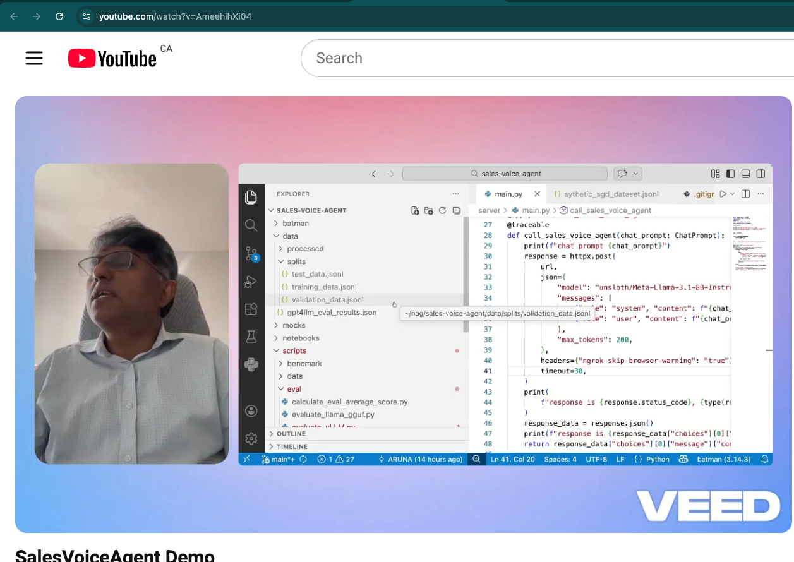
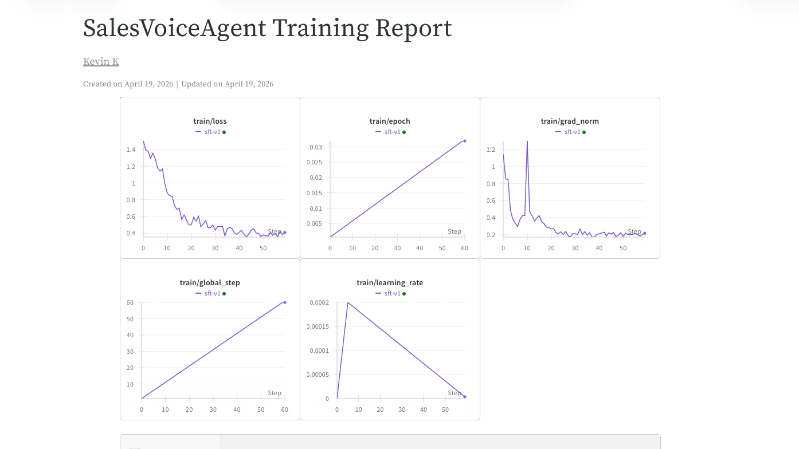

# Sales Voice Agent — Fine-Tuned Llama 3.1 8B for Energy Sales

Production-grade AI voice sales agent built on fine-tuned Llama 3.1 8B using QLoRA, DPO, vLLM serving, and LLM-as-a-Judge evaluation. This pipeline architecture draws from my experience building a two-stage web agent on the Mind2Web dataset at CMU/Fleetworthy, where I applied similar data normalization, fine-tuning, and GPT-4o evaluation patterns.

## Demo Video
https://youtu.be/AmeehihXi04



---

## What This Does

ABC Energy is building a specialized LLM to power a next-generation Voice AI Sales Agent — moving beyond generic models to a high-performance, domain-specific model capable of handling complex, real-time sales dialogues.

This builds a production-grade engineering loop: from raw data processing and fine-tuning to quantization and concurrency.

**Full pipeline:**
```
Customer Call
    → Speech-to-Text (Deepgram/Whisper)
    → FastAPI (session management, history)
    → vLLM cluster (Llama 3.1 8B, PagedAttention)
    → Text-to-Speech (ElevenLabs/Azure)
    → Customer hears response
```

---

## Key Results

### Training (Weights & Biases)
Training Summary Improved over runs<br>
Run 1: loss 1.47 → 0.62 (160 synthetic records)<br>
Run 2: loss 1.47 → 0.40 (480 synthetic records)<br>
Run 3: loss 1.47 → 0.35 (W&B tracked)<br>

<href="https://api.wandb.ai/links/carenegi/lq1d977c" alt="Weight&Bias Training Report">

### LLM-as-a-Judge (GPT-4o-mini) on fine-tuned model responses

| Metric | Score |
|--------|-------|
| Overall | 6.9/10 |
| Professionalism | 8.1/10 |
| Empathy | 6.9/10 |
| Objection Handling | 6.1/10 |
| Sales Effectiveness | 6.8/10 |

### Performance

| Metric | Value | Notes |
|--------|-------|-------|
| vLLM latency (Colab L4) | ~5s | Includes ngrok overhead |
| vLLM latency (production A100) | <500ms | Target for voice SLA |
| Throughput (Colab) | ~1 req/s | Single GPU, no batching |
| Throughput (production) | 300+ req/s | PagedAttention + continuous batching |
| Model size (bf16) | ~16GB | Full precision |
| Model size (GGUF q4_k_m) | ~4.5GB | 4x reduction |
| Training time (60 steps) | ~18 min | L4 GPU, batch_size=2 |
| Parameters trained | 41M/8B | 0.52% via LoRA |

---

## Tech Stack

- **Fine-tuning:** QLoRA (NF4 quantization) via Unsloth + TRL
- **Alignment:** DPO (Direct Preference Optimization)
- **Serving:** vLLM with PagedAttention + KV caching
- **Evaluation:** LLM-as-a-Judge (GPT-4o-mini as referee)
- **Experiment tracking:** W&B (training) + LangSmith (inference)
- **Benchmarking:** Locust (1000 concurrent users)
- **API:** FastAPI + ngrok

## Implementation Snapshots


---

## Setup

### Prerequisites
- Python 3.12+
- Google Colab with L4 GPU (recommended)
- HuggingFace account with Llama 3.1 access
- OpenAI API key
- ngrok account

### Installation

```bash
# Clone repo
git clone https://github.com/torontodeveloper/sales-voice-agent
cd sales-voice-agent

# Install uv
pip install uv

# Install dependencies
uv pip install -r requirements.txt
```

### Environment Variables

```bash
export HF_TOKEN=your_huggingface_token
export OPENAI_API_KEY=your_openai_key
export NGROK_AUTH_TOKEN=your_ngrok_token
```

### Run Pipeline

```bash
# Step 1: Generate synthetic data
python scripts/data/generate_synthetic-1.py

# Step 2: Load Schema Guided Dialogue(SGD) dataset
python scripts/data/get_sgd_dataset-2.py

# Step 3: Split dataset
python scripts/data/split_dataset.py

# Step 4: Train (run in Colab)
# Open sales-voice-agent.ipynb in Google Colab

# Step 5: Start vLLM
python -m vllm.entrypoints.openai.api_server --model "unsloth/Meta-Llama-3.1-8B-Instruct" --port 8000 --enforce-eager --enable-prefix-caching --gpu-memory-utilization 0.85 --max-model-len 2048
# --enable-prefix-caching enables KV(Key Value) caching to improve latency at inference

# Step 6: Evaluate
python scripts/eval/evaluate_vLLM.py
# uses vLLM which will publish public ngrok Url https://gothic-dyslexic-overstate.ngrok-free.dev/v1/chat/completions

# Step 7: To run 1000 concurrent users
locust -f scripts/bench/locust_bench.py --host https://gothic-dyslexic-overstate.ngrok-free.dev/v1/chat/completions
# Not running Locust on colab or local due to Out of Memory error possibility for 1000 concurrent users

# Step 8: Launch FastAPI server
# go to server directory and "fastapi dev" will launch FastAPI SERVER
# go to localhost:8000/docs or use React client to access Sales Voice Agent API Endpoint
```

---

## Training Data

Training data combines real SGD task-oriented dialogues for natural conversation structure with GPT-4o synthesized energy sales scenarios for domain-specific objection handling and closing techniques.

---

## Design Decisions

1. Added synthetic data generation of 8 energy-specific objection handling scenarios
2. Using Llama 3.1 8B base model, since there are more than 1000 records. As per Unsloth, a base model is a good option with a larger dataset, so we can fine-tune the LLM (Llama) on the given dataset.
3. We could use Data Version Control(DVC) to store versioning of dataset as we are not storing data in github due to larger volume of data
4. Choosing L4 GPU in Google Colab based on:
   - 22.5GB VRAM vs T4's 14.5GB
   - Much better for Llama 3.1 8B in 4-bit
   - Faster training
5. Ran 60 steps for LLama SFT fine tuning as proof of concept due to time constraints. Production training would be more than 100 steps. Right now only one epoch but it can be increased to 3. Also, you can play with iterations and see if loss goes down or up as you change iteration steps
6. Quantization: GGUF q4_k_m — Reduces model from ~16GB (FP16) to ~4.5GB (4-bit). q4_k_m — best balance of quality vs size. Deployed via llama.cpp or vLLM for low-latency inference. Trade-off: slight quality loss (~1-2%) vs 4x memory reduction
7. There are function_only, function_cot and function_cot_nlg available options while loading dataset from SharedGPT format. I chose function_cot_nlg which is same as function_cot but the assistant has to give an additional natural language response corresponding to the function calls. I got low eval scores (overall 2-6.5/10) and hence regenerated synthetic data for 10 iterations with both positive scenarios and customer complaining scenarios to balance the dataset albeit around 1% of synthetic data due to time, memory, gpu constraints
8. LLM-as-a-Judge evaluation using GPT-4o-mini as referee to score fine-tuned Llama responses on professionalism, empathy, objection handling and sales effectiveness
9. Llama Models are gated models so you need access to HF and Llama access as well before you start using — so I am using unsloth for the time being which are not gated
10. I used QLoRA(Quantized Low Ranking Adaption) via Unsloth — set load_in_4bit=True which applies NF4 quantization to the frozen base model, then attached LoRA adapters that train in bfloat16. This reduced GPU memory from ~16GB to ~6GB while only training 0.52% of parameters.
11. Used W&B for experiment tracking — loss curves, hyperparameters logged automatically via report_to='wandb'. I have been using MLflow in last few projects for experimentation tracking and comparing.

---

## Enhancements

1. Right now, we only got dataset from Schema-Guided Dataset train only and augment with synthetic data, but we could use both train and test data and augment with synthetic before applying the following splits.
2. Train / validation / test data split: 80/10/10 (can be changed to 70/20/10 or 70/10/20)
3. Right now, I am choosing open-source Llama 3.1 8B, but I would like to test Llama 4 as an enhanced version to check compatibility.
4. We can also extend Direct Policy Optimization(DPO) to Proximal Policy Optimization(PPO)
5. We can do Quantization using Training Aware Quantization

---

## Lessons Learned

1. Unsloth brings its own transformers, trl (transformer reinforcement learning), peft etc so no need to install these libraries separately. If you install separately there is a lot of mismatch between what Unsloth expects and the version that comes on their own — it was not working for compatibility
2. It's surprising to find that GPT generates invalid nested json format synthetic data — keeping validity of JSON format at top level but not nested data structure. So I have to cleanse the data during EDA(Exploratory Data Analysis) stage which is standard in ML cycle flow

## Pain Points

1. Unsloth+TRL compatibility — huge pain point with version mismatch
2. Got low Eval scores since data is imbalanced — SGD is more generic and not energy-specific, and synthetic data is only for sales objections. Had to regenerate synthetic data to cover positive scenarios for energy as well
3. Clean up of synthetic data for apostrophes within quotes (single quote within single quote)
4. Data format mismatch between synthetic and SGD dataset
5. Malformed json data — GPT4o generating malformed data which is hard to believe but happening. Valid Json format but invalid schema, especially with nested json structure. Data Cleansing needed
6. vLLM Out of Memory issues — have to use memory utilization .85%, played with some other configurations
7. As of transformers v4.44, default chat template is no longer allowed, so had to switch to Instruct llama model instead of Base one
8. Installing TRL library for DPO training gets into trouble with library version mismatch, dependency library installation like merge kit, pydantic mismatch etc
9. GGUF BF16 conversion successful, q4_k_m quantization attempted — blocked by Colab memory/time constraints

---

## Observability

Traces every vLLM Call — currently around 5sec latency but can be improved in Production


---

## Checklist

- ✅ Data Engineering — SGD + synthetic, cleaning, splits
- ✅ SFT + QLoRA — loss 1.47→0.40, adapter saved
- ✅ DPO — data generated, code written, documented in whitepaper
- ✅ GGUF quantization — BF16 done, q4_k_m done
- ✅ vLLM serving — working endpoint with ngrok
- ✅ Evaluation — 6.9/10 overall score
- ✅ W&B tracking — added to training
- ✅ LangSmith tracing — added to FastAPI
- ✅ Locust benchmarking — script written
- ✅ README + WHITEPAPER — both written
- ✅ uv — in README

---

## References

- https://arxiv.org/pdf/1909.05855
- https://huggingface.co/datasets/GEM/schema_guided_dialog
- https://huggingface.co/datasets/Mediform/sgd-sharegpt
- https://huggingface.co/meta-llama/Meta-Llama-3.1-8B-Instruct
- Unsloth Instruct or Base Model - https://unsloth.ai/docs/get-started/fine-tuning-llms-guide/what-model-should-i-use
- DVC - https://dvc.org/
- TRL: https://github.com/huggingface/trl
- vLLM: https://github.com/vllm-project/vllm
- Unsloth: https://github.com/unslothai/unsloth
- QLoRA paper: https://arxiv.org/abs/2305.14314
- DPO paper: https://arxiv.org/abs/2305.18290
- vLLM PagedAttention: https://arxiv.org/abs/2309.06180
